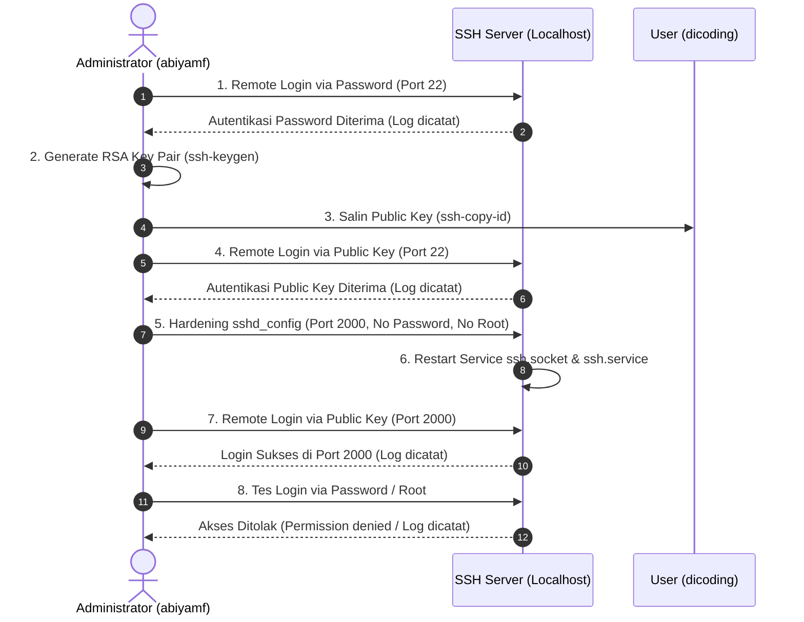

# Dicoding - Menjadi Linux System Administrator

Repositori ini berisi seluruh proyek submission untuk kelas **Menjadi Linux System Administrator** di Dicoding Academy. Seluruh submission dikerjakan secara komprehensif dengan memenuhi seluruh kriteria wajib serta mengimplementasikan semua saran yang diberikan guna meraih predikat tertinggi **Bintang 5 (Skor Maksimal)**.

[](https://ubuntu.com/)
[](https://www.gnu.org/software/bash/)
[](https://www.openssh.com/)
[](https://gnupg.org/)
[-success)](#ringkasan-kriteria-penilaian-bintang-5)

---

## Daftar Isi

- [Struktur Repositori](#struktur-repositori)
- [Ringkasan Kriteria Penilaian (Bintang 5)](#ringkasan-kriteria-penilaian-bintang-5)
- [Submission Pertama: Proyek Shell Scripting](#submission-pertama-proyek-shell-scripting)
  - [Deskripsi Skenario](#deskripsi-skenario-submission-1)
  - [Implementasi Script & Kriteria](#implementasi-script--kriteria)
  - [Penerapan Saran Bintang 5](#penerapan-saran-bintang-5-submission-1)
  - [Daftar Berkas Submission 1](#daftar-berkas-submission-1)
- [Submission Kedua: Proyek Konfigurasi SSH Server](#submission-kedua-proyek-konfigurasi-ssh-server)
  - [Deskripsi Skenario](#deskripsi-skenario-submission-2)
  - [Alur Konfigurasi SSH Server](#alur-konfigurasi-ssh-server)
  - [Penerapan Saran Bintang 5](#penerapan-saran-bintang-5-submission-2)
  - [Catatan untuk Reviewer](#catatan-untuk-reviewer)
  - [Daftar Berkas Submission 2](#daftar-berkas-submission-2)
- [Panduan Menjalankan & Verifikasi](#panduan-menjalankan--verifikasi)

---

## Struktur Repositori

```text
Dicoding-MenjadiLinuxSystemAdministrator/
├── README.md                                    # Dokumentasi komprehensif proyek
├── submission-pertama/                          # Proyek 1: Shell Scripting
│   ├── instruksi_submission.md                  # Panduan kriteria submission 1
│   ├── script.sh                                # Skrip monitoring memori dan filesystem
│   ├── history.txt                              # Rekaman riwayat perintah shell (history)
│   └── submission1-linux-abiyamakruf.zip        # Berkas ZIP siap unggah ke platform Dicoding
└── submission-kedua/                            # Proyek 2: Konfigurasi SSH Server
    ├── instruksi_submission.md                  # Panduan kriteria submission 2
    ├── daftar-user.txt                          # Daftar seluruh pengguna pada sistem Linux
    ├── daftar-user.txt.gpg                      # Hasil enkripsi simetris GPG daftar-user.txt
    ├── sshd_config                              # Salinan konfigurasi SSH hardened (port 2000)
    ├── log-ssh.txt                              # Entri rekaman log autentikasi SSH
    ├── log-ssh.json                             # Rekaman log SSH dalam format JSON terstruktur
    ├── hapus-log.sh                             # Skrip pemantauan & pembersihan log journalctl
    └── submission2-linux-abiyamakruf.zip        # Berkas ZIP siap unggah ke platform Dicoding
```

---

## Ringkasan Kriteria Penilaian (Bintang 5)

| Proyek | Kriteria Wajib | Saran Tambahan (Bintang 5) | Status |
| :--- | :--- | :--- | :---: |
| **Submission 1 (Shell Scripting)** | 1. Memeriksa memori dalam Megabytes (`free -m`)<br>2. Memeriksa kapasitas disk dalam Gigabytes (`df -BG`)<br>3. Filter kolom `Filesystem` & `Use%` tanpa `tmpfs` (`df -x tmpfs --output=source,pcent`)<br>4. Output rapi (teks keterangan, jeda `sleep 1`, baris baru)<br>5. Melampirkan `history.txt` | 1. Komentar deskriptif di setiap baris perintah skrip<br>2. Variabel `name="Abiya Makruf"` & cetak `'Hello, my name is ${name}'`<br>3. Perulangan `while` berjalan sebanyak 3 kali | **Terpenuhi (Bintang 5)** |
| **Submission 2 (Konfigurasi SSH Server)** | 1. User baru `dicoding` dengan Full Name `Dicoding Indonesia`<br>2. Login SSH via password ke `localhost`<br>3. Key pair & salin public key (`ssh-copy-id`), remote login via public key<br>4. Hardening SSH: Port `2000`, hanya public key, nonaktifkan password & root login<br>5. Login sukses via port 2000 & tercatat pada log<br>6. Melampirkan `daftar-user.txt`, `log-ssh.txt`, `sshd_config` | 1. Berkas log SSH format JSON (`log-ssh.json`)<br>2. Berkas terenkripsi `daftar-user.txt.gpg`<br>3. Skrip otomatisasi `hapus-log.sh` (`journalctl --disk-usage`, `--vacuum-size=10M`, jeda, komentar, loop `while`) | **Terpenuhi (Bintang 5)** |

---

## Submission Pertama: Proyek Shell Scripting

### Deskripsi Skenario Submission 1
Sebagai seorang Linux System Administrator, lonjakan trafik pada server web perusahaan menyebabkan memori dan ruang disk rawan penuh. Sebelum dilakukan skalabilitas jangka panjang, dibuat shell script otomatis (`script.sh`) untuk memeriksa kondisi sistem secara berkala dan terdokumentasi dalam `history.txt`.

### Implementasi Script & Kriteria
Skrip `submission-pertama/script.sh` mengimplementasikan seluruh ketentuan:
1. **Menampilkan Ukuran Memori:** Menggunakan perintah `free -m` (satuan Megabytes).
2. **Menampilkan Kapasitas Filesystem:** Menggunakan perintah `df -BG` (satuan Gigabytes).
3. **Menampilkan Filter Kolom Disk:** Menggunakan perintah `df -x tmpfs --output=source,pcent` untuk hanya menampilkan kolom `Filesystem` dan `Use%` serta mengecualikan seluruh `tmpfs`.
4. **Format & Kerapian Tampilan:**
   - Setiap perintah diawali teks pengantar/keterangan yang jelas.
   - Diberikan jeda 1 detik (`sleep 1`) sebelum berpindah ke perintah selanjutnya.
   - Dipisahkan baris baru (`echo ""`) antar output agar tidak menumpuk.

### Penerapan Saran Bintang 5 (Submission 1)
- **Komentar Deskriptif:** Setiap baris perintah didahului baris komentar penjelas.
- **Variabel Identitas:** Mendefinisikan variabel `name="Abiya Makruf"` dan mencetak salam pembuka `Hello, my name is ${name}`.
- **Perulangan While:** Menjalankan seluruh alur pengecekan sebanyak **3 kali** menggunakan konstruksi `while [ $counter -le 3 ]`.

### Daftar Berkas Submission 1
- [script.sh](file:///c:/Users/abiyamf/Documents/Code%20Program/Dicoding/Dicoding-MenjadiLinuxSystemAdministrator/submission-pertama/script.sh): Berkas shell script utama.
- [history.txt](file:///c:/Users/abiyamf/Documents/Code%20Program/Dicoding/Dicoding-MenjadiLinuxSystemAdministrator/submission-pertama/history.txt): Riwayat eksekusi perintah terminal shell.
- `submission1-linux-abiyamakruf.zip`: Berkas arsip kompresi siap submit.

---

## Submission Kedua: Proyek Konfigurasi SSH Server

### Deskripsi Skenario Submission 2
Server baru telah dipasang untuk melayani trafik pengguna 24/7. Agar administrator dapat memantau dan mengelola server secara aman dari jarak jauh, dikonfigurasikan layanan SSH Server dengan standar pengerasan keamanan (*security hardening*) tingkat tinggi.

### Alur Konfigurasi SSH Server



1. **Pembuatan User Baru:**
   - Dibuat user `dicoding` dengan nama lengkap `Dicoding Indonesia` melalui:
     ```bash
     sudo adduser --gecos "Dicoding Indonesia" dicoding
     ```
2. **Pengujian Login Password & Key Exchange:**
   - Melakukan SSH remote login menggunakan password ke `dicoding@localhost`.
   - Membuat pasangan kunci RSA (`ssh-keygen -t rsa -b 4096`).
   - Menyalin kunci publik ke mesin tujuan (`ssh-copy-id -i ~/.ssh/id_rsa.pub dicoding@localhost`).
   - Melakukan login remote dengan public key.
3. **Hardening Konfigurasi SSH (`/etc/ssh/sshd_config`):**
   - `Port 2000` -> Mengubah port standar 22 menjadi port 2000.
   - `PubkeyAuthentication yes` -> Mengaktifkan autentikasi berbasis kunci publik.
   - `PasswordAuthentication no` -> Menonaktifkan autentikasi menggunakan password.
   - `PermitRootLogin no` -> Mencegah login langsung sebagai user root.
4. **Validasi Port 2000 & Pembatasan:**
   - Remote login ke `dicoding@localhost` pada port 2000 menggunakan public key berhasil.
   - Uji coba login password pada port 2000 ditolak (`Permission denied (publickey)`).
   - Uji coba remote login sebagai `root` ditolak (`Permission denied (publickey)`).
   - Seluruh aktivitas tercatat secara lengkap pada `systemd-journald`.

### Penerapan Saran Bintang 5 (Submission 2)
1. **Saran 1 - `log-ssh.json`:** Mengekstrak seluruh log layanan SSH dalam format JSON terstruktur menggunakan `journalctl -u ssh -o json-pretty`.
2. **Saran 2 - `daftar-user.txt.gpg`:** Mengenkripsi berkas `daftar-user.txt` secara simetris menggunakan algoritma AES256 GnuPG (`gpg -c`).
3. **Saran 3 - `hapus-log.sh`:** Skrip pembersihan log journalctl otomatis dengan alur:
   - Menampilkan ukuran disk journalctl aktif dan arsip (`journalctl --disk-usage`).
   - Membersihkan log hingga berkisar 10 MB (`journalctl --vacuum-size=10M`).
   - Menampilkan kembali ukuran disk journalctl untuk verifikasi.
   - Dilengkapi komentar, baris pemisah, jeda waktu, dan perulangan `while`.

### Catatan untuk Reviewer
> [!IMPORTANT]
> - **Password Enkripsi Berkas GPG (`daftar-user.txt.gpg`):** `dicoding`
> - Untuk melakukan dekripsi berkas verifikasi:
>   ```bash
>   gpg -d daftar-user.txt.gpg
>   ```

### Daftar Berkas Submission 2
- [daftar-user.txt](file:///c:/Users/abiyamf/Documents/Code%20Program/Dicoding/Dicoding-MenjadiLinuxSystemAdministrator/submission-kedua/daftar-user.txt): Daftar pengguna sistem yang memuat entri `dicoding:x:1002:1002:Dicoding Indonesia,,,:/home/dicoding:/bin/bash`.
- [daftar-user.txt.gpg](file:///c:/Users/abiyamf/Documents/Code%20Program/Dicoding/Dicoding-MenjadiLinuxSystemAdministrator/submission-kedua/daftar-user.txt.gpg): Berkas terenkripsi GPG dengan passphrase `dicoding`.
- [sshd_config](file:///c:/Users/abiyamf/Documents/Code%20Program/Dicoding/Dicoding-MenjadiLinuxSystemAdministrator/submission-kedua/sshd_config): Konfigurasi SSH Server yang telah di-hardening.
- [log-ssh.txt](file:///c:/Users/abiyamf/Documents/Code%20Program/Dicoding/Dicoding-MenjadiLinuxSystemAdministrator/submission-kedua/log-ssh.txt): Log autentikasi SSH teks biasa.
- [log-ssh.json](file:///c:/Users/abiyamf/Documents/Code%20Program/Dicoding/Dicoding-MenjadiLinuxSystemAdministrator/submission-kedua/log-ssh.json): Log autentikasi SSH format JSON.
- [hapus-log.sh](file:///c:/Users/abiyamf/Documents/Code%20Program/Dicoding/Dicoding-MenjadiLinuxSystemAdministrator/submission-kedua/hapus-log.sh): Skrip otomatisasi pembersihan log sistem.
- `submission2-linux-abiyamakruf.zip`: Berkas arsip kompresi siap submit.

---

## Panduan Menjalankan & Verifikasi

### 1. Menjalankan Skrip Submission 1
```bash
cd submission-pertama
chmod +x script.sh
./script.sh
```

### 2. Memeriksa Dekripsi Berkas GPG Submission 2
```bash
cd submission-kedua
gpg -d daftar-user.txt.gpg
# Masukkan passphrase: dicoding
```

### 3. Menjalankan Skrip Pembersihan Log Submission 2
```bash
cd submission-kedua
chmod +x hapus-log.sh
# Menjalankan 1 siklus pengujian:
./hapus-log.sh 1

# Atau menjalankan terus berulang (infinite loop):
./hapus-log.sh
```
